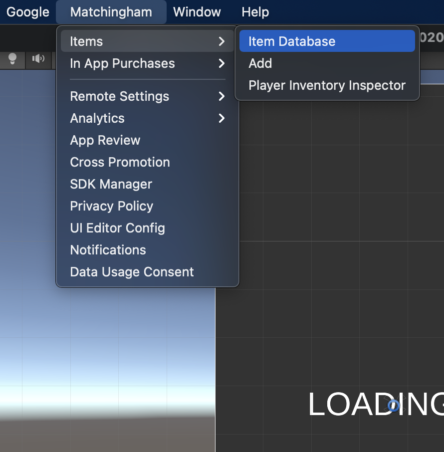
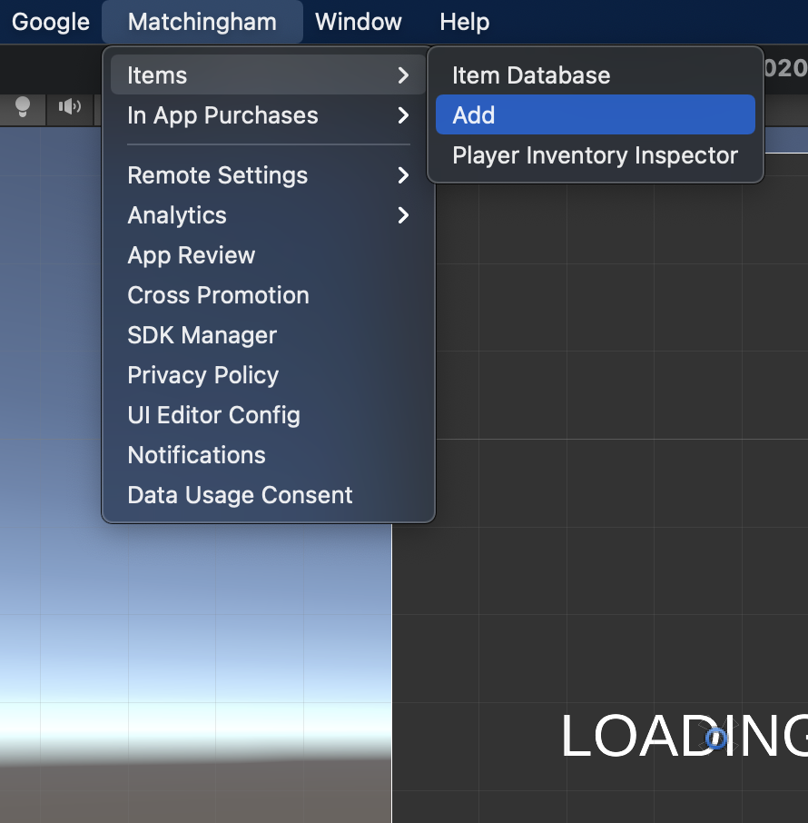
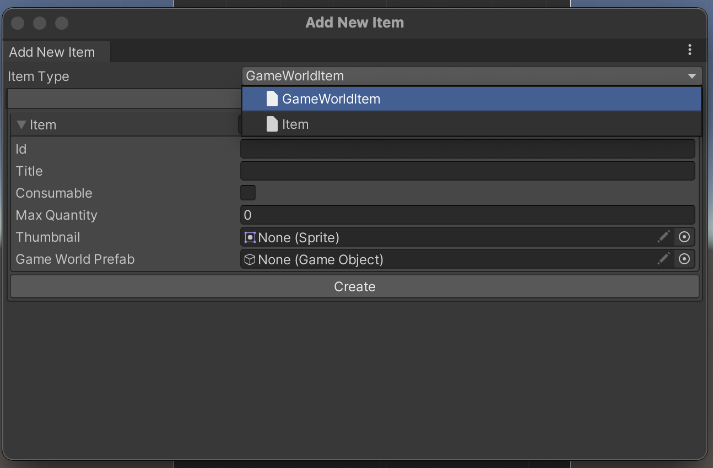
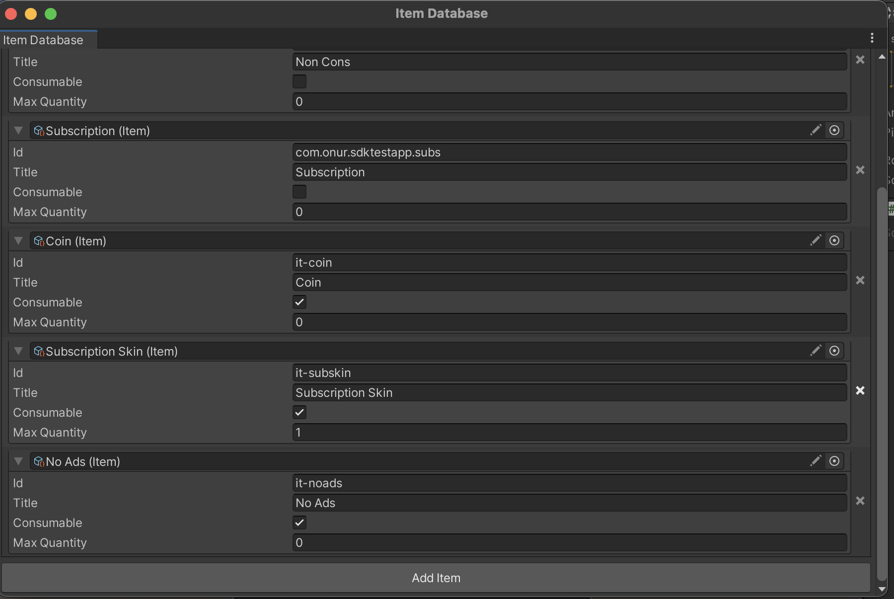

# BACKPACK INVENTORY MODULE

## Introduction

Inventory management and item database

## How to use

* Import package from Package Manager UI
* Open item database from `Matchingham > Items > Item Database`. You can manage your items from here.
  
  

* Either click `Add Item` from `Item Database` editor window, or click `Matchingham > Items > Add Item`
  
  

* Select the type of item you want to add from the dropdown
* Enter item details and hit `Create`
* Use `AddItem(itemId: string, quantity: int (1))` method to add an item to player's inventory, with
  optional quantity. If you don't provide the quantity parameter, it will be 1 by default
* Use `RemoveItem(itemId: string, quantity: int (1))` to remove given quantity of given item from player's
  inventory
* Use `GetOwnedQuantity(itemId: string)` to get owned item quantity in player's inventory for provided item id
* You can check if player has an item using the `HasItem(itemId: string)` method
* Use `IsMaxCapacity(itemId: string)` to check if the owned quantity of an item has reached max value in player
  inventory. If so, `AddItem` calls will not add additional items...
* Use `GetEntries()` method to enumerate all item entries in the player's inventory

## How does this work?

By default, backpack provides you with a basic item data class that has no in game representation. These kind
of items can be used for in game resource management, like player money, hard currency etc. If you want, you
can create new item types with custom fields, like in-game prefab, ui representation, just make sure that
class inherits from `Item` class.

For example, creating a custom item that can be placed in game world with player input, which will also
have a ui representation (for user to select which item will be placed) can be defined like this:

```c#
public class GameWorldItem : Item
{
    public Sprite thumbnail;
    public GameObject gameWorldPrefab;
}
```

You can then use the `Matchingham > Items > Add Item` menu to define items using the new `GameWorldItem` class.
After defining some items of this type, you can use Backpack API methods to add, remove, check and query owned
quantity of each one like other items.



* NOTE: The `Max Quantity` field defines how many of that item the inventory can hold. Leave it `0`for no limit.

If you have an item that you don't want in the project anymore, you can remove it using the 
`Matchingham > Items > Item Database` menu. From here, find the item you want to remove from the project,
then hit the small 'x' button on the right side of the entry to delete the item. Please note that doing this
on a live project might cause problems as the item might be referenced in player's inventory. If the item
must be removed, write a simple script to check player inventory and remove invalid items from
it.



## API & Details


* **Initialize()**: Starts module initialization. You don't need to call this method, it is called automatically
  at app startup.
  

* **GetEntries()**: Returns an `IEnumerable<ItemEntry>`. This object represents the items inside the player's 
  inventory.
  

* **GetSlots(itemId: string)**: Returns all slot instances for the same item. You can use
this to implement an item that has modifiable data fields. So each instance of the same item
can have different data, which means you need to be able to manage them individually, instead
of managing them as a stack of the same item.


* **GetSlot(itemId: string, slotIndex: int)**: Returns the data of a specific slot in the stack. For example if you have 5 items of 'Iron Sword', calling this method as 
`GetSlots("it-ironsword", 2)` will return the data of the third 'Iron Sword' in the stack.


* **HasItem(itemId: string)**: Checks if the user has a certain item.


* **GetOwnedQuantity(itemId: string)**: Returns a value indicating how many of the given item player owns.


* **IsMaxCapacity(itemId: string)**: Returns a value indicating whether the player owns maximum allowed 
  number of a certain item type.


* **AddItem(itemId: string, quantity: int (1))**: Adds given item to player inventory, with provided quantity.
  If no quantity is provided, only adds 1.


* **AddItem(itemId: string, slotIndex: int)**: Used to add a single item to inventory with custom data. Use this with items that has customizable data fields.


* **RemoveItem(itemId: string, quantity: int (1))**: Removes given item from player inventory, with provided quantity.
  If no quantity is provided, only removes 1.


* **RemoveItem(slot: int, itemId: string)**: Removes the item in the specific slot in the stack. Use this with items that has customizable data fields.


* **WhenInitialized(Action)**: Allows you to register a callback that will be fired only
  after the module is successfully initialized. Use this to execute logic that requires
  this module to be initialized first. If the module has already initialized, immediately
  invokes the callback.


* **WhenFailedToInitialize(Action)**: Allows you to register a callback that will be fired only after
  the module fails to initialize for any reason. Use this to handle what should happen
  in case this module fails to initialize. If the module has already failed to initialize, immediately
  invokes the callback.
  

* **WhenReady(callback)**: Combined version of `WhenInitialized` and `WhenFailedToInitialize`.
  Delays execution of callback till module is first initialized or failed to initialize, immediately invoke
  the callback if it is already initialized or failed to initialize.