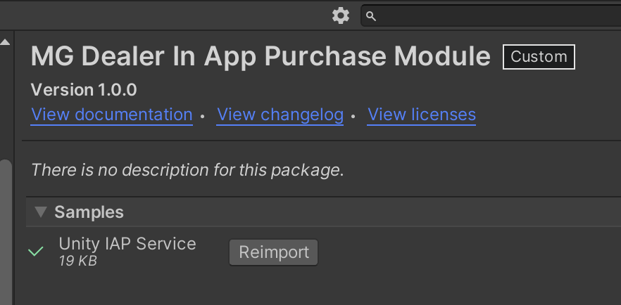
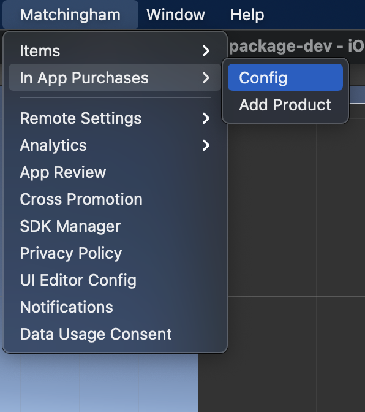
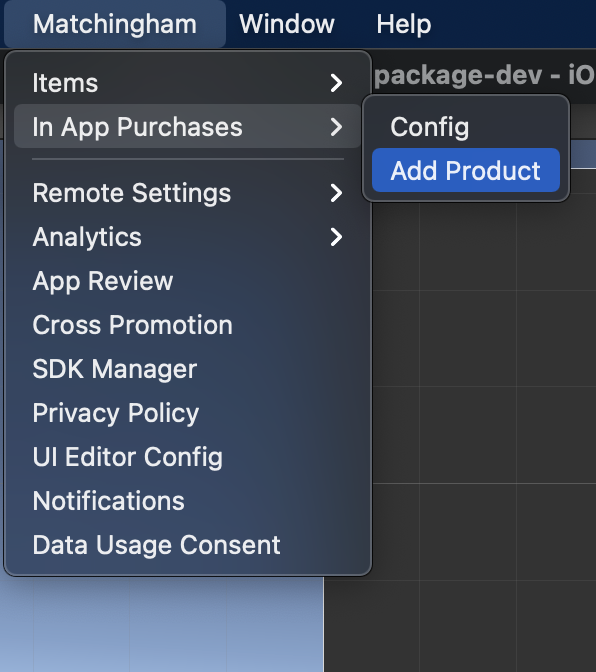
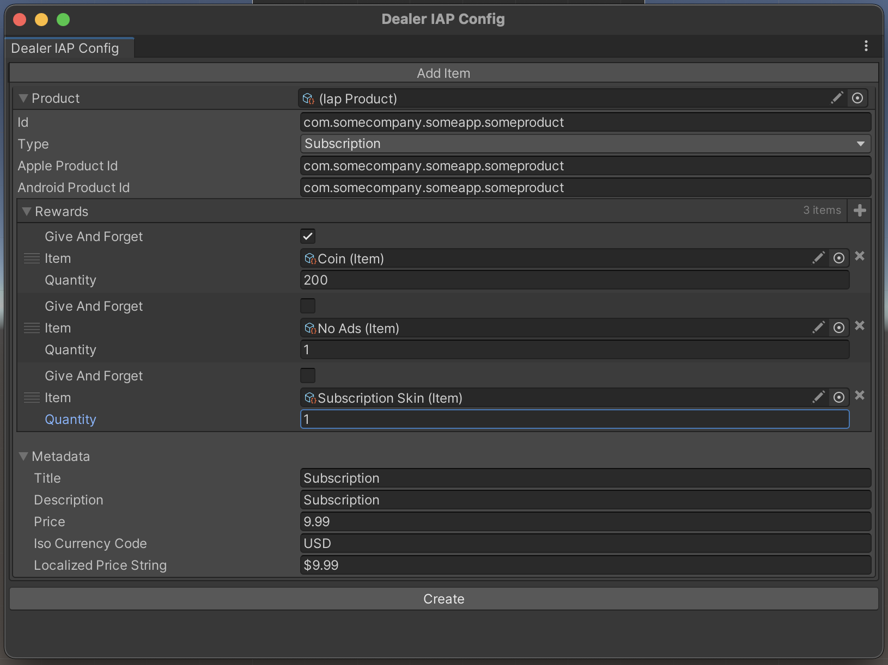

# DEALER IN APP PURCHASE MODULE

## Introduction

Dealer module is for managing IAP Products easily. It allows you to create, edit and delete products 
from editor GUIs and provides a simple API to initiate purchases, or restore previous purchases.

## How to Use

* Import Dealer proxy module from Package Manager UI.
* By default, the proxy module comes bundled with the Unity IAP service as a sample that can be imported from the
  Package Manager UI.
    * If you are going to use Unity IAP, you need to first prepare it. Follow Unity's documentation for
      setting up Unity Purchasing.
    * After Unity IAP is set up correctly, import the Unity IAP sample from the Package Manager UI.
      
      


* Now, open product list from `Matchingham > In App Purchases > Config`
  
  


* To add a new product, either click `Add Product` in Dealer Iap Config editor, or 
  navigate to `Matchingham > In App Purchases > Add Product`.
  
  


* From the `Add Product` window, enter product details (id, store specific id for android and ios app stores)
    * Make sure product ids follow the format: com.[company].[game].[productid]. 
      For example: com.somecomp.somegame.subs.
    * This is important because analytics integration uses this format to detect which item is purchased.
    
* Hit create to create the product. It will be listed in product list, and an item that will represent the iap
  product will automatically be created and added to item database. 
    * You can use this item to check if the user has a certain in-app product purchased.

* Make sure to call `Dealer.Instance.Initialize()` at the appropriate place to initialize module.
    
## How does this work?

Dealer is a proxy module. It provides a static API, that will be used for all IAP operations, regardless of
what IAP framework/service is being used. By default, it comes with a Unity Purchasing service integration
ready to import as a sample. It is a sample because Unity Purchasing gerenates some code inside the `Assets`
folder. Because of this, Unity Iap Service needs to be inside the `Assets` folder, otherwise there would be
compile errors, as unity first compiles the package assemblies, then the project assembly.

You can create custom IAP service implementations by implementing `IDealerService` interface.

```c#
public interface IDealerService : IAsyncInitialize
{
    event BusyStateDelegate BusyStateChanged;
    event PurchaseSuccessDelegate Purchased;
    event PurchaseFailDelegate Failed;
    event Action RestoreSuccess;
    event Action RestoreFailed;
    event ProductExpireDelegate Expired;
    
    void Initialize();
    void RequestRestore();
    void RequestPurchase(string productId, params string[] tags);
    IEnumerable<IapProduct> GetProducts(Func<IapProduct, bool> filter);
    IapProduct GetProduct(string productId);
}
```

### Product Definition

An IAP Product needs an in-game product id. Dealer uses this id to initiate purchases, track them and also
send analytics data. Store specific ids are provided separately for android and ios. The sample product
definition in the below image is a subscription item.
* Subscription type is selected in the `Type` dropdown
* It has 3 rewards defined:
    * 200 coins that are rewarded at purchase. These coins are not deduced from the inventory when subscription
      expires. (`Give And Forget` is checked)
    * No Ads item is also rewarded to the player. This item is deduced from player inventory when the subscription
      expires. (`Give And Forget` is NOT checked)
    * Subscription Skin is a cosmetic item that the player is allowed to own as long as they have a subscription.
      So it is deduced from player inventory when subscription expires. (`Give And Forget` is NOT checked)
* By default, this product is listed with following metadata. This data is overwritten with metadata from the
  store:
    * Title is `Subscription`, and product description is `Subscription`.
    * It is listed with `$9.99` (9.99 USD) price tag.
    * For analytics info, price and currency code is also provided separately.



## API & Details


* **Initialize()**: Starts module initialization. You need to call this method at the appropriate place.
  

* **event BusyStateChanged**: Notifies that Dealer service is busy.
  ```c#
  public delegate void BusyStateDelegate(bool isBusy);
  ```
  * This event can be used to toggle in game indicators like a loading/processing view for the iap operation.
  * If the provided parameter is `true` this means that module is busy processing either a 
    purchase or a restore. 
  * If the provided parameter is `false` this means that module is not busy.
  
  
* **event Purchased**: Notifies that a purchase operation was successful. 
  ```c#
  public delegate void PurchaseSuccessDelegate(PurchaseInfo info, bool notifyUser);
  ```
  * Use this event to display a success feedback to the user.
  

* **event Failed**: Notifies that a purchase operation has failed.
  ```c#
  public delegate void PurchaseFailDelegate(IapProduct product, PurchaseFailReason failReason, bool notifyUser);
  ```
  * Use this event to display a failure feedback to the user.
  
  
* **event RestoreSuccess**: Notifies that restore request was successful.
  * You can use this event to display a restore successful message.
  

* **event RestoreFailed**: Notifies that restore request failed.
  * You can use this event to display a restore failure message.
  

* **event Expired**: Notifies that a product has expired.
  ```c#
  public delegate void ProductExpireDelegate(IapProduct product);
  ```
  * If you want to notify a user that their subscription has expired, you can use this event.
  

* **RequestRestore()**: Asks the store provider to restore user's previously purchased products.


* **RequestPurchase(productId: string, tags: params string[])**: Asks the store to start purchasing flow
  for a certain in app product described by the `productId`.
  * You can provide custom tags using the `tags` parameter to provide purchase metadata for analytics. 
    * For example, purchases made from an in game shop interface can provide `in-game-shop` tag while
      an item purchased from an in game campaign banner can provide `some-campaign-banner` tag. This allows
      in depth analysis of in app purchases.
      

* **GetProducts(filter: Func<IapProduct, bool> (null))**: Returns list of all products.
  * You can use the optional filter parameter to filter items returned.
  

* **GetProduct(productId: string)**: Try to get a specific product using its id. If no item exists with that id,
  returns `null`.
  

* **IsPurchased(IapProduct product)**: Checks whether the product with given id is purchased 
  (currently in player's inventory).


* **WhenInitialized(Action)**: Allows you to register a callback that will be fired only
  after the module is successfully initialized. Use this to execute logic that requires
  this module to be initialized first. If the module has already initialized, immediately
  invokes the callback.


* **WhenFailedToInitialize(Action)**: Allows you to register a callback that will be fired only after
  the module fails to initialize for any reason. Use this to handle what should happen
  in case this module fails to initialize. If the module has already failed to initialize, immediately
  invokes the callback.


* **WhenReady(Action)**: Combined version of `WhenInitialized` and `WhenFailedToInitialize`.
  Delays execution of callback till module is first initialized or failed to initialize, immediately invoke
  the callback if it is already initialized or failed to initialize.