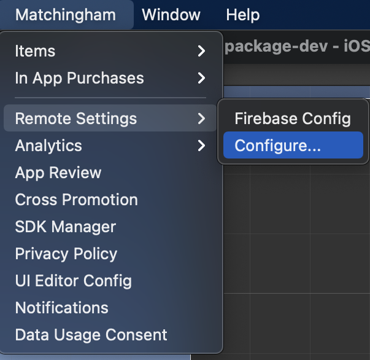
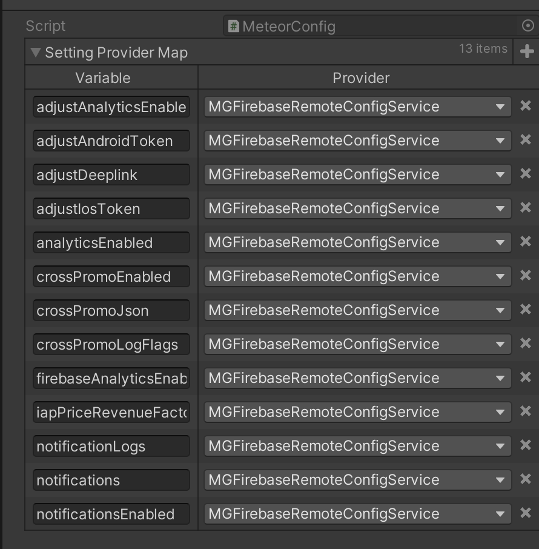

# METEOR REMOTE CONFIG MODULE

## Introduction

Provides a unified methodology for receiving remote configuration from different sources, or even multiple
sources at the same time.

## How to Use

* Install package from Package Manager UI
* Install one or more Meteor Service Packages from Package Manager UI. These services are what actually handle 
  fetching and loading remote settings.
* Open settings from `Matchingham > Remote Settings > Configure`. You can also configure services individually
  from the same `Matchingham > Remote Settings` menu.
* Make sure to call `Meteor.Instance.Initialize()` method in the appropriate place.
* Group settings you want to be remote configurable into `Scriptable Object`s. Meteor requires config
  objects to be `Scriptable Object`s or they cannot be tracked!
* Mark fields with `Remote Setting` attribute to make them remote compatible. By default, the field name is used
  as the remote key, however, you can provide a custom one as a constructor parameter.
  ```c#
  [RemoteSetting("myModuleEnabled")]
  public bool enabled;
  ```
  * If you want multiple different fields to be managed by the same remote config field, you need to mark
    one of them the default value. So in case remote fetch fails, the system will have a default value. This
    is achieved by adding `Use As Default Value` attribute to one of these fields.
    
    ```c#
    public class MyConfig : ScriptableObject
    {
        [UseAsDefaultValue]
        [RemoteSetting("myConfigEnabled")]
        public bool enabled;
    }
    
    public class TheirConfig : ScriptableObject
    {
        [RemoteSetting("myConfigEnabled")]
        public bool isMyConfigEnabled;
    }
    ```
    
* Just read values from the scriptable objects like you normally do, the values will be the remote values.

  ```c#
  // Reading value without remote settings
  mySettingObject.myValue;
  
  // Reading value with remote settings (With Meteor initialized and myValue marked as remote setting)
  mySettingObject.myValue;
  ```

## How does this work?

Meteor collects fields marked with `Remote Setting` attribute in scriptable objects registered to Meteor.
It then maps them to a default remote provider if there are any imported. These mapping data can be changed
from the module settings from `Matchingham > Remote Settings > Configure` menu.



When initialized, meteor first crates a dictionary holding the default values for each remote setting. 
Then it attempts to initialize all imported remote provider services with the collected default values 
passed in as fall back. When a service is initialized, it notifies Meteor that its values are ready, so
meteor syncs remote settings that are mapped to the initialized service. When all services are initialized,
meteor initialization is complete.

Because meteor is a proxy module, you can easily integrate new remote providers by implementing the 
`IRemoteSettingsService` interface. This interface defines the API which Meteor proxy uses to initialize the
service, get notified when it is done and get remote values.

```c#
public interface IRemoteSettingsService
{
    void Initialize(Dictionary<string, object> defaultRemoteSettings, Action<RemoteInitializationResult> initialized);
    object GetValue(Type type, string key);
}
```

Create a service provider for the remote settings provider you want to integrate and make sure it implements
the above interface. Then register an instance of the service you coded with `Meteor.services.Add(serviceInstance)`
call. Make sure this registration is done before Meteor is initialized!

The only thing you need to do at this point is, mapping some remote settings to the new provider service you coded.
Just like with other services, you can do this from Meteor settings from `Matchingham > Remote Settings > Configure`
menu.



## API & Details


* **Initialize()**: Starts module initialization. You need to call this at the
  appropriate place.
  

* **Dispose()**: Call this method when game is closing. In editor, this also resets remote fields back to their
  original values, so the default values are not corrupted.


* **WhenInitialized(Action)**: Allows you to register a callback that will be fired only
  after the module is successfully initialized. Use this to execute logic that requires
  this module to be initialized first. If the module has already initialized, immediately
  invokes the callback.
  

* **WhenFailedToInitialize(Action)**: Allows you to register a callback that will be fired only after
  the module fails to initialize for any reason. Use this to handle what should happen
  in case this module fails to initialize. If the module has already failed to initialize, immediately
  invokes the callback.


* **WhenReady(Action)**: Combined version of `WhenInitialized` and `WhenFailedToInitialize`.
  Delays execution of callback till module is first initialized or failed to initialize, immediately invoke
  the callback if it is already initialized or failed to initialize.

