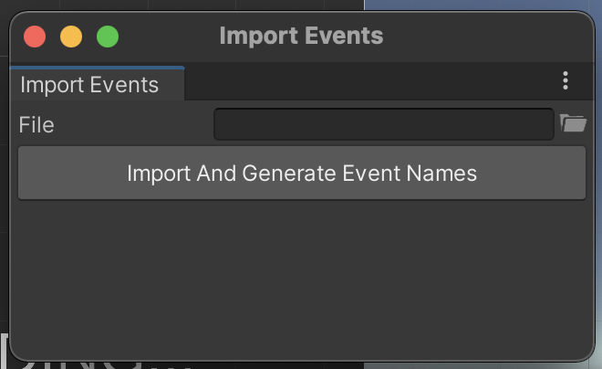
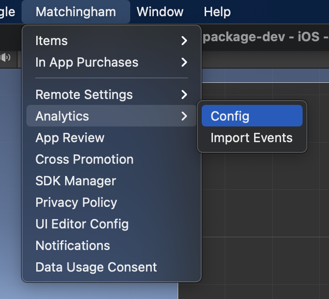
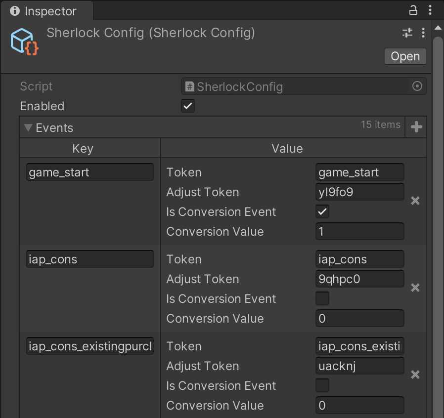

# SHERLOCK ANALYTICS MODULE

## Introduction

Sherlock module is a proxy module for initializing multiple analytics services at the same time. It also
provides an event importer that can import adjust analytics events from a CSV file, and generates
the same events for all other analytics services that support custom event mapping.

## How to Use

* Import package from Package Manager UI.
* Import analytics service implementations that you want to use from Package Manager UI.
* Make sure to call `Sherlock.Instance.Initialize()` at the appropriate place.
* Open `Matchingham > Analytics > Config`. Make sure `Enabled` checkbox is checked.
* Open `Matchingham > Analytics > Import Events` menu and open `Event Importer`.
    * `Event Importer` parses events from a file in CSV format.
        ```
        event name,adjusttoken,[OPTIONAL]conversion value
        ```
      
* Each supported service provides an interface. To send analytics to a certain service, request that service
  from Sherlock Analytics Module and use the returned instance.
    * If you request a supported service that is not imported, Sherlock will return a Null Object that will
      mock the API calls. This allows the code base to remain the same even if some analytics services are 
      removed from the project.
      

Sample level analytics calls:
```c#
Sherlock.Instance.GetService<IAdjustAnalyticsService>().SendCustom(SherlockUtility.GetLevelEventName(level, "start"));
Sherlock.Instance.GetService<IFirebaseAnalyticsService>().SendCustom(SherlockUtility.GetLevelEventName(level, "start"));
Sherlock.Instance.GetService<IFirebaseAnalyticsService>().SendLevelStart($"level{level}");
```

Sample custom analytics event calls:
```c#
Sherlock.Instance.GetService<IAdjustAnalyticsService>().SendCustom(EventNames.GameStart);
Sherlock.Instance.GetService<IFirebaseAnalyticsService>().SendCustom(EventNames.GameStart);
```
* The `EventName` class is auto generated. This happens when CSV file is imported from the event importer.

## How does This Work

Sherlock event definition logic works centered around adjust events. Below is a sample adjust events CSV file
```
iap_cons,9qhpc0
iap_cons_existingpurchasepending,uacknj
iap_cons_paymentdeclined,dd8nu8
iap_cons_productunavailable,9u28pf
iap_cons_purchasingunavailable,4y3cd3
iap_cons_signatureinvalid,7skdqp
iap_subs,hzhgi
iap_noncons,qnm8wl
level1_complete,t494ux,2
level1_fail,347c9h
level1_start,q9hv5v
level2_complete,ws75fg,3
level2_fail,s4xg0l
level2_start,9qktjs
game_start,yl9fo9,1
```

This file is imported to the project using the `Mathingham > Analytics > Import Events`. After the file is selected,
hit the `Import and Generate Event Names` button.



Once this operation is complete, the file will be parsed and events will be generated. You can see and 
further configure these events from the settings inspector. To Open settings inspector, use the 
`Matchingham > Analytics > Config` menu.



Adjust requires developers to send conversion events if the user doesn't allow ATT. Conversion event
and value configuration is configured here. 
* To make an event a conversion event, check the `Is Conversion Event` checkbox and set the `Conversion Value` field



## Tracking Level Timing

To track how much time a player spends in a level, you can use `LevelTimeStatManager.Instance.StartLevel(level:int)`
and `LevelTimeStatManager.Instance.FinishLevel(level:int)` methods. By default, level time manager pauses time 
stat tracking when app loses focus. This behaviour can be disabled by setting `LevelTimeStatManager.Instance.OverridePuase`
flag to `true`. Then you can use `LevelTimeStatManager.Instance.PauseLevel(level:int)` and 
`LevelTimeStatManager.Instance.Resume(level:int)` methods to pause and resume levels according to your own flow.

## API & Details

### Sherlock


* **Initialize()**: Starts module initialization. You need to call this at the
  appropriate place
  


* **RegisterService(service: IAnalyticsService)**: Used to register analytics services to Sherlock
  module. This method is only used by analytics service adapters.
  


* **GetService < T > ()**: Returns current implementation of the requested service type. Currently requested
  service types:
    * IAdjustAnalyticsService
    * IFirebaseAnalyticsService
    * IAdmostAnalyticsService


* **WhenInitialized(Action)**: Allows you to register a callback that will be fired only
  after the module is successfully initialized. Use this to execute logic that requires
  this module to be initialized first. If the module has already initialized, immediately
  invokes the callback.


* **WhenFailedToInitialize(Action)**: Allows you to register a callback that will be fired only after
  the module fails to initialize for any reason. Use this to handle what should happen
  in case this module fails to initialize. If the module has already failed to initialize, immediately
  invokes the callback.


* **WhenReady(Action)**: Combined version of `WhenInitialized` and `WhenFailedToInitialize`.
  Delays execution of callback till module is first initialized or failed to initialize, immediately invoke
  the callback if it is already initialized or failed to initialize.
  

### Adjust Analytics Service


* **SendCustom(eventName: string, parameters: Dictionary<string, object> (null))**:
Allows sending a custom, self styled analytics event. Most of the events are sent
with this method.


* **SendAdRevenue(source: string, payload: string)**: Ad revenue tracking event.
  

* **SendECPMEvent(eventName: string, ecpm: float, currency: string)**: ECPM tracking event.
  

* **SendInAppPurchaseRevenueEvent(eventName: string, price: float, currency: string)**: In App Purchase
revenue event.
  

* **SendInAppPurchaseRevenueEvent(eventName: string, transactionId: string, price: float, currency: string)**:
Overload of `SendInAppPurchasEvent`. This accepts an additional `transactionId` parameter.
  

### Admost Analytics Service:


* **SendCustom(eventName: string, parameters: Dictionary<string, object> (null))**:
  Allows sending a custom, self styled analytics event. Most of the events are sent
  with this method.

* **SendIapEvent(tags: string[], identifier: string, receipt: string, isoCurrencyCode: string, localPrice: float)**:
Admost in app purchase analytics event. Accepts custom tags to categorize in app purchases. These tags can
indicate things like which interface the purchase was made from.
  

### Firebase Analytics Service:


* **SendCustom(eventName: string, parameters: Dictionary<string, object> (null))**:
  Allows sending a custom, self styled analytics event. Most of the events are sent
  with this method.
  

* **SendAppOpen()**: When game initialization is complete, this event should be sent
  

* **SendCustomInAppPurchase(token: string, itemId: string, currencyCode: string, price: float)**: Firebase normally 
collects in app purchase events itself. However, if you want, you can use these to send them as a custom
event.
  

* **SendEarnVirtualCurrency(currency: string, amount: long)**: This event is used to log whenever the user 
earns virtual currency in game.
  

* **SendEarnVirtualCurrency(currency: string, amount: double)**: Overload of the same analytics event. Uses
a double parameter instead of long.
  

* **SendLevelStart(levelName: string)**: Firebase provides a specialized level start analytics event.
This method sends that event.
  

* **SendLevelEnd(levelName: string, success: bool)**: Firebase provides a specialized end start analytics event.
This method sends that event.
  

* **SendLevelUp(level: long)**: Firebase provides a specialized event for tracking player level ups.
This method sends that event.
  

* **SendLevelUp(level: long, character: string)**: Firebase provides a specialized event for tracking player level ups.
This method sends that event, but with an additional `character` parameter. This allows which character
was leveled up, for more detailed usage analytics data in games with multiple character support.
  

* **SendScreenView(screenName: string)**: Firebase provides a specialized event for tracking which app screen
is viewed. This method sends that event.
  

* **SendScreenView(screenClass: string, screenName: string)**: Firebase provides a specialized event for tracking which app screen
is viewed. This method sends that event, but also provides the view class.
  

* **SendSpendVirtualCurrency(currency: string, itemName: string, amount: long)**: Firebase provides specialized
events for tracking where the user spends their virtual currency. This method sends that event
  

* **SendSpendVirtualCurrency(currency: string, itemName: string, amount: double)**: Firebase provides specialized
events for tracking where the user spends their virtual currency.
  

* **SendTutorialBegin()**: Firebase provides special analytics events for tracking when the tutorial starts.
This method sends that event.
  

* **SendTutorialEnd()**: Firebase provides special analytics events for tracking when the tutorial ends.
  This method sends that event.


### LevelTimeStatManager

* **OverridePause : bool**: Set this flag to true if you want to handle pause/resume logic yourself


* **StartLevel(level: int)**: Starts tracking a level. You need to calls this when user starts playin the level


* **FinishLevel(level: int)**: Stops tracking a level and calculates passed time, sends it to firebase.
  * If client is offline, the stats are saved to player prefs to be sent later.


* **PauseLevel(level: int)**: Pauses time tracking for a level. The level must be started first.


* **ResumeLevel(level: int)**: Resumes time tracking for a level. The level must be started first.

