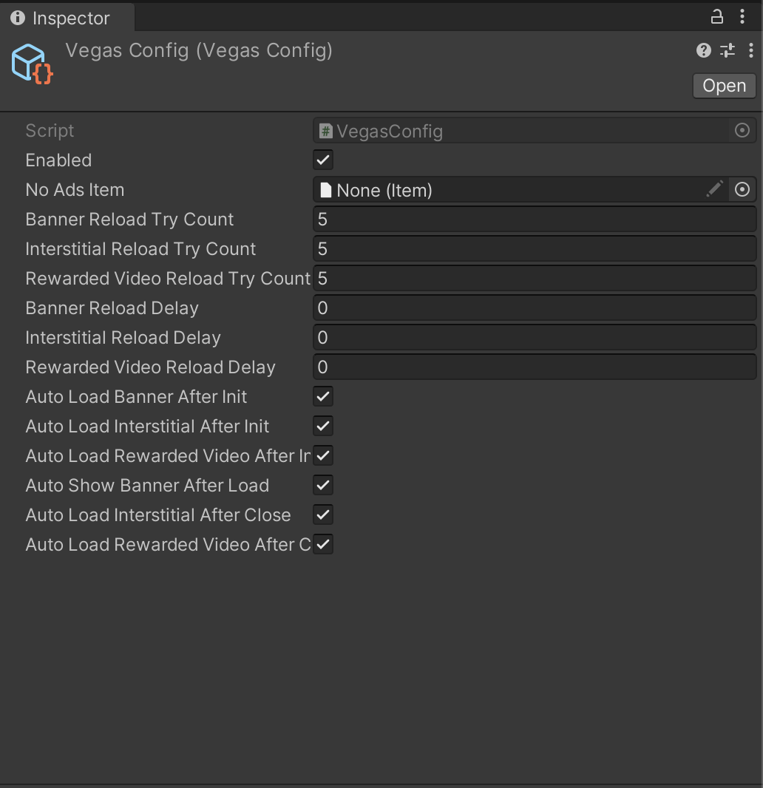

# VEGAS MEDIATION MODULE

## Introduction

Vegas module is a proxy module for initializing and importing mediation SDKs easier and faster.  

## How to use

* Import package from Package Manager UI
* Import mediation service implementation what you want to use from Package Manager UI. Unlike other modules, Vegas can work with only one mediation service. But, you can swap mediation service without changing your code.
  * Currently, only Admost is available.
* Open `Matchingham > Mediation > Config`. Make sure `Enabled` checkbox is checked.
* Make sure to call `Vegas.Instance.Initialize()` at the appropriate place
  * After successful initialization, you can call ads however you want. Vegas supports three ad types: `Banner, Interstitial, Rewarded Video`
    * For example: 
    ```c#
    Vegas.ShowBanner();
    Vegas.ShowInterstitial();
    Vegas.ShowRewardedVideo();
    ```
    
## How does this work?
First mediation service will initialize itself. Then, Vegas will initialize based on its config. When you call for an ad on Vegas, it will call its service for that. If `Meteor - Remote Config Module` is added, Vegas' settings can be change on the go. Make sure that the mediation service's config is correct. These are explained in `Services` section. If `Backpack - Inventory Module` is added, when the user buys a product contains "no-ads" item, Banner and Interstitials will be disabled automatically. Make sure that "no-ads" item is referenced in Vegas config.



## API & Details

### Banner
* By default, banner is loaded after initialization and shown after being successfully loaded.
#### Methods
* **LoadBanner()**: Loads banner manually.
* **ShowBanner()**: Shows banner manually. Use it if you need to hide it before.
* **HideBanner()**: Hides banner.
* **DestroyBanner()**: Destroys banner.

#### Events
* **BannerLoaded**: Invokes when banner is successfully loaded.
* **BannerFailedToLoad**: Invokes when banner couldn't be loaded. 
* **BannerShown**: Invokes when banner is on screen.
* **BannerHidden**: Invokes when banner becomes hidden.
* **BannerClicked**: Invokes when user clicks the banner.
* **BannerLoadedStatusChanged**: Invokes when banner availability for display is changed.

#### Fields
* **IsBannerShown**: If banner is on screen
* **IsBannerLoaded**: If banner is loaded
* **IsBannerLoading**: If banner is loading

### Interstitial
* By default, interstitials are loaded after initialization.

#### Methods
* **LoadInterstitial()**: Loads interstitial manually.
* **ShowInterstitial(string adTag)**: Shows Interstitial. `adTag`: If you have additional tag for it, you can enter. Default is null.

#### Fields
* **IsInterstitialLoaded**: If interstitial is loaded
* **IsInterstitialLoading**: If interstitial is loading

#### Events
* **InterstitialLoaded**: Invokes when interstitial is loaded
* **InterstitialFailedToLoad**: Invokes when interstitial couldn't be loaded
* **InterstitialShown**: Invokes when interstitial is started
* **InterstitialFailedToShow**: Invokes when interstitial couldn't start
* **InterstitialClicked**: Invokes when the user clicks interstitial
* **InterstitialClosed**: Invokes when interstitial is closed
* **InterstitialLoadedStatusChanged**: Invokes when interstitial availability is changed

### Rewarded Video
* By default, rewarded videos are loaded after initialization.

#### Methods
* **LoadRewardedVideo()**: Loads rewarded video manually
* **ShowRewardedVideo(Action onSuccessCallback, Action onFailCallback, string adTag)**: Shows rewarded video. `onSuccessCallback`: Will be invoked if the user watches rewarded video. (e.g. giving reward) `onFailCallback`: Will be invoked if the user fails watching rewarded video. `adTag`: If you have additional tag for it, you can enter. Default is null.

#### Events
* **RewardedVideoLoaded**: Invokes when rewarded video is loaded
* **RewardedVideoFailedToLoad**: Invokes when rewarded video couldn't be loaded
* **RewardedVideoShown**: Invokes when rewarded video is started
* **RewardedVideoFailedToShow**: Invokes when rewarded video couldn't start
* **RewardedVideoClicked**: Invokes when the user clicks rewarded video
* **RewardedVideoClosed(bool result)**: Invokes when rewarded video is closed. `result`: If the user watched rewarded video successfully  
* **RewardedVideoLoadedStatusChanged**: Invokes when rewarded video availability is changed

## Services

### Dummy Mediation
Mediation services won't work on editor. Thus, we made a dummy one, so you can test mediation-related scenarios on editor. To set them, you can go to `Matchingham > Mediation > Services > Dummy Mediation Config` Also, if you want to build your project with dummy service, you must add `MG_DUMMY_MEDIATION` to Scripting Define Symbols.

### Admost Mediation Service
Nearly all mediation SDK's has its own integration manager for enabling ad networks and adding their adapters. Thus, we made our own integration manager for Admost to make it easier to deal with it. Once you added it from Package Manager UI, you can go to `Matchingham > Mediation > Services > Admost Integration Helper`. 


* Make sure that all fields are filled with correct information. After that, press `Save` button to save settings.
* AMR Adapter is mandatory. Thus, after installing it, you can see other adapters.
#### Special cases for Adapters

##### Admob
* If you added `Admob` adapter, make sure that `Admob Application Id Ios` and `Admob Application Id Android` fields are filled. **Otherwise, application will crash at launch.**

##### Applovin
* If you added `Applovin` adapter, make sure that `Applovin Sdk Key` is filled. **Otherwise, application will crash at launch.**

#### eCPM Events
* If you want to send eCPM values to Admost, fill `Cpm Events` list. Default values are `100, 500, 1000`. 
* **You have to fill sherlock events list for CPM events as well. Their name have to be like this:** `CPMgreaterthanX` (X = ecpm value) For example:
```
CPMgraterthan100
CPMgraterthan500
CPMgraterthan1000
```