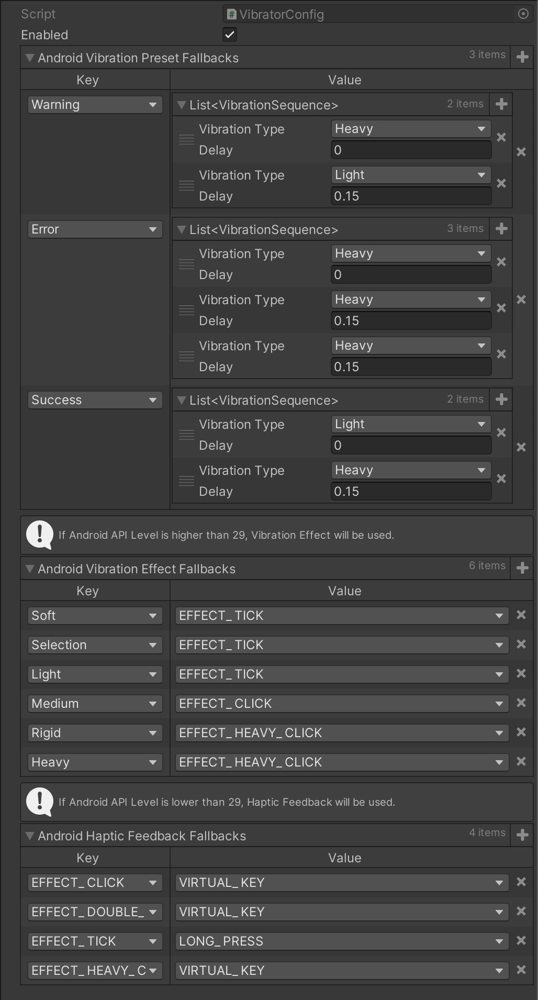

# VIBRATION MODULE

## Introduction

Vibrator module is a proxy module for handling iOS and Android Vibration/Haptic Feedback at the same time. Since Unity still doesn't support custom vibration, we had to do by our own.

## How to use

* Import package from Package Manager UI
* Open `Matchingham > Vibrator > Config`. Make sure `Enabled` checkbox is checked.
* Call the methods wherever you want.

## How does this work?

It uses native libraries of the platforms. iOS Taptic Engine is great but on Android, things are weird. The experience can be different by devices and OS versions. Vibrator module is mimicking iOS Taptic Engine. On Android we have `VibrationEffect`. Although it supports different amplitudes, some devices don't. But still we can observe different types of vibration. Because there is another API for it: `HapticFeedback`. It is mostly used by buttons and keyboards. To support as many Android devices as possible, we matched these like this: On Android 10 or higher, `VibrationEffectConstants` will be used. Others will use `HapticFeedbackConstants`. Our config file has already matched them. But, you can change it on ispector.



## API & Details

### Common

#### Enums

* **VibrationType**: Based on iOS Taptic Engine. Default, Android equivalents based on API Level are written next to it. (For more information, see also `Platform Specific > Android`) You can change it from Config.
``` 
Soft : 29+ EFFECT_TICK, 28- LONG_PRESS
Selection : 29+ EFFECT_TICK, 28- LONG_PRESS
Light : 29+ EFFECT_TICK, 28- LONG_PRESS
Medium : 29+ EFFECT_CLICK, 28- VIRTUAL_KEY
Rigid : 29+ EFFECT_HEAVY_CLICK, 28- VIRTUAL_KEY
Heavy : 29+ EFFECT_HEAVY_CLICK, 28- VIRTUAL_KEY
```

* **VibrationPreset**: Based on iOS Taptic Engine. You can change it from Config.
```
Warning // Heavy + 0.15sec + Light
Error // Heavy + 0.15sec + Heavy + 0.15sec + Heavy
Success // Light + 0.15sec + Heavy
```    

#### Models

* **VibrationSequence**:
  * **VibrationType** VibrationType
  * **float** Delay

#### Fields

* **Enabled**: To enable/disable the vibrator. If not set, Config's `Enabled` value will be applied.

#### Methods

* **Vibrate(VibrationType type)**: Vibrate device once. `type`: Type of the vibration.
* **VibratePreset(VibrationPreset preset)**: Vibrate device according to given preset. `preset`: Predefined sequence of vibration.
* **VibrateSequence(params VibrationSequence[] sequence)**: Vibrate device according to given sequence array. `sequence`: Sequence array of vibration.

### Platform Specific

#### Android

On Android, there are two classes for vibration. 

##### VibrationEffect

###### Enums

* **VibrationEffectConstants**: API Level 29 and above
```
EFFECT_CLICK // A click effect. Use this effect as a baseline, as it's the most common type of click effect.
EFFECT_DOUBLE_CLICK // A double click effect.              
EFFECT_HEAVY_CLICK // A heavy click effect. This effect is stronger than EFFECT_CLICK.
EFFECT_TICK // A tick effect. This effect is less strong compared to EFFECT_CLICK.
```

###### Methods
* **VibratePredefined(VibrationEffectConstants effectID)**: Vibrates device by given effect. `effectID`: One of the constants defined in VibrationEffectConstants. Returns if the vibration is successful or not. For example, if the device OS is lower than 10, this will return false.
* **VibrateOneShot(long milliseconds, int amplitude)**: Create a one shot vibration. One shot vibrations will vibrate constantly for the specified period of time at the specified amplitude, and then stop. `miliseconds`: Duration `amplitude`: The strength of the vibration. Some devices may not have amplitude control. If that so, amplitude value won't be used. Returns if the vibration is successful or not.
* **VibrateWaveform(long[] timings, int repeat)**: Create a waveform vibration. `timings`: time between vibrations. Returns if the vibration is successful or not.
* **VibrateWaveform(long[] timings, int[] amplitudes, int repeat)**: Create a waveform vibration. `timings`: time between vibrations. `amplitudes`: The strength pair with `timings`. Some devices may not have amplitude control. If that so, amplitude value won't be used. Returns if the vibration is successful or not.

##### HapticFeedback

This is for a more immersive view on native apps, but also the most similar feedback with iOS Taptic Engine on older Android devices. 

###### Enums

* **HapticFeedbackConstants**: On some devices, some of them might not work.
```
// API Level 30+
GESTURE_END // The user has finished a gesture (e.g. on the soft keyboard).
GESTURE_START // The user has started a gesture (e.g. on the soft keyboard).
CONFIRM // A haptic effect to signal the confirmation or successful completion of a user interaction.
REJECT // A haptic effect to signal the rejection or failure of a user interaction.
       
// API Level 27+
KEYBOARD_PRESS // The user has pressed a virtual or software keyboard key.
KEYBOARD_RELEASE // The user has released a virtual keyboard key.
TEXT_HANDLE_MOVE // The user has performed a selection/insertion handle move on text field
VIRTUAL_KEY_RELEASE // The user has released a virtual key.
        
// API Level 23+
CONTEXT_CLICK // The user has performed a context click on an object.
        
// API Level 21+
CLOCK_TICK // The user has pressed either an hour or minute tick of a Clock.
        
// API Level 8+
KEYBOARD_TAP // The user has pressed a soft keyboard key.
      
// API Level 5+
VIRTUAL_KEY // The user has pressed on a virtual on-screen key.
        
// API Level 3+
LONG_PRESS // The user has performed a long press on an object that is resulting in an action being performed.
```

###### Methods

* **Feedback(HapticFeedbackConstants key)**: Provide haptic feedback to the user. `key`: One of the constants defined in HapticFeedbackConstants.

***

#### iOS

Although Vibrator module is basically same with iOS Taptic Engine API, you can still call iOS API by yourself. 

##### Enums

* **ImpactFeedback**:
``` 
Soft
Selection
Light
Medium
Rigid
Heavy
```

* **NotificationFeedback**:
```
Warning // Heavy + Light
Error // Heavy + Heavy + Heavy
Success // Light + Heavy
```   

##### Methods

* **Impact(ImpactFeedback feedback)**: Vibrate iOS Device by given type. `feedback`: Vibration type
* **Notify(NotificationFeedback feedback)**: Vibrate iOS Device by given preset. `feedback`: Vibration preset